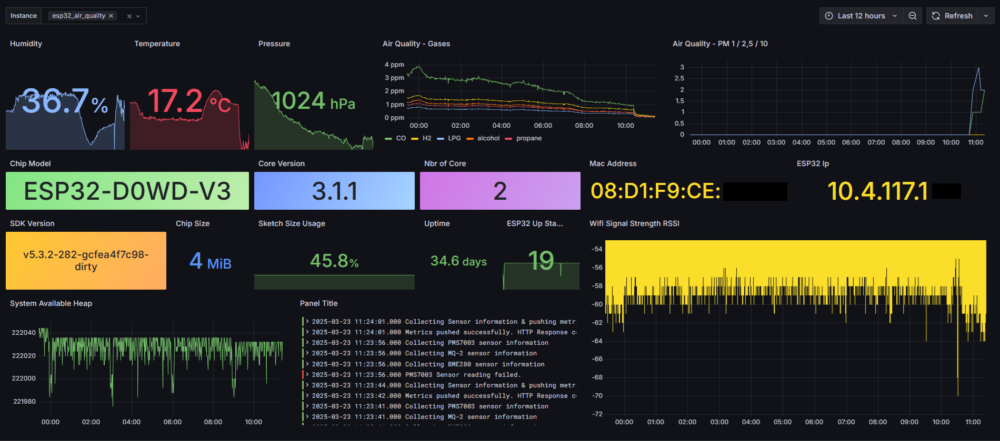

# esp32-pms7003-mq2-bme280-prometheus

his project is a homemade air quality sensor that pushes metrics & logs to a Grafana/Loki/Prometheus stack.

### Components

| Component                    | Price  |
| ---------------------------- | ------ |
| ESP32 Dev Board       | 10 ≈$   |
| [BME280](https://www.bosch-sensortec.com/products/environmental-sensors/humidity-sensors-bme280/)                   | 2 ≈$   |
| MQ-2                   | 3 ≈$   |
| [PMS7003](https://plantower.com/en/products_33/76.html)                   | 35 ≈$   |


Total is approximately 50$

### Preview

todo

### Dashboard



### Installation

#### Arduino 

Under `main` : <br> 

- Configure `Config.h` 

Wifi credentials
```cpp
#define WIFI_SSID ""
#define WIFI_PASSWORD ""
```

Loki and Pushgateway endpoints IP on the local network.
```cpp
#define LOKI_HOST "10.4.x.x"
#define LOKI_PORT 3100

#define PUSHGATEWAY_HOST "10.4.x.x"
#define PUSHGATEWAY_PORT 9090
#define PUSHGATEWAY_JOB "esp32_metrics"
```


Whether ESP32C3 should push Internal (System & Wifi) metrics and metric push rate in ms.
```cpp
#define SYSTEM_METRIC true
#define WIFI_METRIC true
#define METRICS_REFRESH_RATE 15000
```

- Configure `Config.cpp`

Wifi configuration to register the ESP32C3 on the local network. Using an explicit dns to resolve the ntp server.
```cpp
# Local Desired IP
const IPAddress local_desired_IP(10, 4, 117, 130);
# Router IP on the local network
const IPAddress gateway_IP(10, 4, 117, 102);
const IPAddress subnet(255, 255, 255, 0);
const IPAddress dns_IP(1, 1, 1, 1); // Needed to resolve pool.ntp.org
```

Ntp server configuration. Used to get current timestamp before pushing logs to Loki.
```cpp
const char *ntpServer1 = "pool.ntp.org";
const char *ntpServer2 = "time.nist.gov";
const long gmtOffset_sec = 3600;
const int daylightOffset_sec = 3600;
```

Observability labels
```cpp
const std::map<String, String> OBSERVABILITY_LABELS = {
    {"instance", INSTANCE},
    {"location", "office"}
};
```

#### Observability Stack 

The observability stack can be installed using a docker compose file.

```docker
cd observability-stack
docker compose -f obs.compose.yaml up -d
```